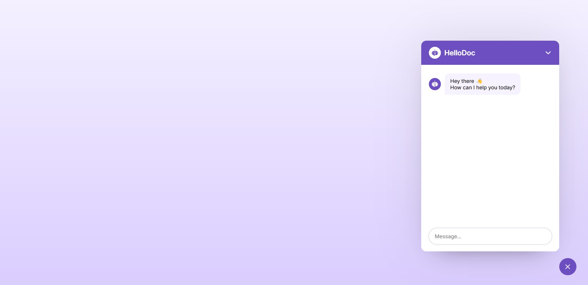

# HelloDoc ChatBot

## Introduction
HelloDoc ChatBot is an AI-powered chatbot designed for efficient doctor-patient interaction. This chatbot provides information about hospital departments, available doctors, appointment scheduling, and general medical assistance. Built using **HTML, CSS, and React with Vite**, it integrates the **Gemini API** for generating responses.

## Features
- **AI-Powered Conversations**: Offers smart and context-aware responses to user queries.
- **Doctor & Department Listings**: Displays available doctors and departments in hospitals.
- **Appointment Scheduling**: Users can check doctor availability and schedule appointments.
- **Medical Assistance**: Provides general medical information and answers health-related queries.
- **Gemini API Integration**: AI-powered responses for better patient interaction.
- **Seamless User Experience**: Intuitive and easy-to-use interface.
- **Responsive Design**: Works smoothly on desktops, tablets, and mobile devices.

### Images of HelloDoc ChatBot:




## Tech Stack
- **Frontend**: HTML, CSS, React with Vite
- **API**: Gemini API for chatbot responses
- **Deployment**: Hosted on a web server for public access

## Project Setup
Follow these steps to set up and run the project locally:

### Prerequisites
Ensure you have the following installed:
- **Node.js** (latest stable version)
- **npm** or **yarn**
- **Git**

### Installation
1. **Clone the repository**
   ```bash
   git clone https://github.com/your-username/HelloDoc-ChatBot.git
   cd HelloDoc-ChatBot
   ```
2. **Install dependencies**
   ```bash
   npm install
   ```
   or
   ```bash
   yarn install
   ```
3. **Run the project**
   ```bash
   npm run dev
   ```
   or
   ```bash
   yarn dev
   ```
4. **Open the project in your browser**
   Navigate to `http://localhost:5173/` (default Vite port).

## Project Structure
```
HelloDoc-ChatBot/
├── public/            # Static assets
├── src/
│   ├── components/    # React components
│   ├── assets/        # Images and icons
│   ├── styles/        # CSS files
│   ├── App.jsx        # Main application file
│   ├── main.jsx       # Entry point for React
│   ├── api/           # API requests and integrations
│   ├── data/          # Sample hospital/doctor data
│   └── utils/         # Helper functions
├── .gitignore         # Git ignore file
├── package.json       # Project dependencies and scripts
├── vite.config.js     # Vite configuration
└── README.md          # Project documentation
```

## How It Works
1. **User sends a message**: The chatbot interface captures user input.
2. **Message is processed**: The chatbot forwards the request to the Gemini API.
3. **AI generates a response**: The AI model returns a relevant response.
4. **Response is displayed**: The chatbot updates the chat window with the AI's reply.

## Development Process
- **Creating a Smart Chatbot UI**: Designed an interactive chat interface for seamless communication.
- **Enhancing User Experience**: Styled the chatbot with engaging visuals and a user-friendly layout.
- **Integrating Gemini API**: Connected the chatbot with AI to generate dynamic and helpful responses.
- **Handling User Input Efficiently**: Implemented form submission and input validation.
- **Adding Popup Chatbot Toggle**: Developed a feature to minimize/maximize the chatbot effortlessly.
- **Managing Errors Gracefully**: Ensured a smooth experience even when unexpected errors occur.
- **Customizing Responses**: Improved chatbot intelligence by dynamically responding to user queries.
- **Testing and Deployment**: Optimized performance and launched the chatbot for real-world usage.

## Future Enhancements
- **Voice Input & Output**: Enable speech recognition and voice response.
- **Database Integration**: Store user interactions and appointment details.
- **User Authentication**: Secure login for patients and doctors.
- **Multi-language Support**: Expand to support multiple languages.

## Contribution
Want to contribute? Follow these steps:
1. Fork the repository.
2. Create a new branch (`git checkout -b feature-branch`).
3. Commit your changes (`git commit -m 'Add new feature'`).
4. Push to the branch (`git push origin feature-branch`).
5. Open a Pull Request.

## License
This project is licensed under the **MIT License**.

## Contact
For any queries, reach out to:
- **Email**: bijayrauniyar90@gmail.com
- **GitHub**: [bijayrauniyar90](https://github.com/bijayrauniyar90)

---
✨ *Empowering healthcare with AI-driven chatbot technology!* ✨